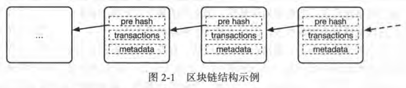

## 定义与原理

> 基本原理

区块链的基本原理理解起来并不复杂 首先，区块链包括三个基本概念：

- 交易 ( transaction )：一次对账本的操作，导致账本状态的一次改变，如添加一条转账记录；
- 区块 ( block )：记录一段时间内发生的所有交易和状态结果，是对当前账本状态的一次共识；
- 链 ( chain )：由区块按照发生顺序串联而成，是整个账本状态变化的日志记录。

如果把区块链作为一个状态机，则每次交易就是试图改变一次状态，而每次共识生成的区块，就是参与者对于区块中交易导致状态改变的结果进行确认。

在实现上，首先假设存在一个分布式的数据记录账本，这个账本只允许添加、不允许删除。账本底层的基本结构是一个线性的链表，这也是其名字 "区块链" 的来源。链表由一个个 "区块" 串联组成 (如下图所示)，后继区块记录前导区块的哈希值 ( pre hash )。新的数据要加入，必须放到一个新的区块中。而这个块 (以及块里的交易) 是否合法，可以通过计算哈希值的方式快速检验出来。任意维护节点都可以提议一个新的合法区块，然而必须经过一定的共识机制来对最终选择的区块达成一致。

> 以比特币为例理解区块链工作过程

以比特币网络为例，可以具体看其中如何使用了区块链技术。首先，比特币客户端发起一项交易，广播到比特币网络中并等待确认。网络中的节点会将一些收到的等待确认的交易记录打包在一起 (此外还要包括前一个区块头部的哈希值等信息)，组成一个候选区块。然后，试图找到一个 nonce 串 (随机串) 放到区块里，使得候选区块的哈希结果满足一定条件 (比如小于某个值)。这个 nonce 串的查找需要一定的时间去进行计算尝试。

一旦节点算出来满足条件的 nonce 串，这个区块在格式上就被认为是 "合法" 了，就可以尝试在网络中将它广播出去。其他节点收到候选区块，进行验证，发现确实符合约定条件了，就承认这个区块是一个合法的新区块，并添加到自己维护的区块链上。当大部分节点都将区块添加到自己维护的区块链结构上时，该区块被网络接受，区块中所包括的交易也就得到确认。

当然，在实现上还会有很多额外的细节。这里面比较关键的步骤有两个：一个是完成对一批交易的共识(创建区块结构)；一个是新的区块添加到区块链结构上，被大家认可，确保未来无法被篡改。

比特币的这种基于算力寻找 nonce 串的共识机制称为工作量证明 ( Proof of Work ，PoW )。目前，要让哈希结果满足一定条件，并无已知的快速启发式算法，只能进行尝试性的暴力计算。尝试的次数越多 (工作量越大)，算出来的概率越大。

通过调节对哈希结果的限制，比特币网络控制平均约 10 分钟产生一个合法区块。算出区块的节点将得到区块中所有交易的管理费和协议固定发放的奖励费 (目前是 12.5 比特币，每四年减半)，这个计算新区块的过程俗称为 "挖矿"。

## 技术的演化与分类

> 区块链技术的三种典型演化场景

| 场景                   | 功能     | 智能合约           | 一致性                                | 权限 | 类型   | 性能   | 编程语言     | 代表       |
| ---------------------- | -------- | ------------------ | ------------------------------------- | ---- | ------ | ------ | ------------ | ---------- |
| 公信的数字货币         | 记账功能 | 不带有或较弱       | PoW                                   | 无   | 公有链 | 较低   | 简单脚本     | 比特币网络 |
| 公信的交易处理         | 智能合约 | 图灵完备           | PoW、PoS                              | 无   | 公有链 | 受限   | 特定语言     | 以太坊网络 |
| 带权限的分布式账本处理 | 商业处理 | 多种语言，图灵完备 | 包括 CFT、 BFT 在内的多种机制，可插拔 | 支持 | 联盟链 | 可扩展 | 高级编程语言 | 超级账本   |

> 基于区块链的分布式账本的特点

- 维护一条不断增长的链，只可能添加记录，而发生过的记录都不可篡改；
- 去中心化，或者说多中心化，无需集中控制而能达成共识，实现上尽量采用分布式；
- 通过密码学的机制来确保交易无法被抵赖和破坏，并尽量保护用户信息和记录的隐私性 。

> 区块链的分类

根据参与者的不同，可以分为公开 ( public ) 链、私有 ( private ) 链和联盟 ( consortium ) 链。

- 公有链，顾名思义，任何人都可以参与使用和维护，如比特币区块链，信息是完全公开的；如果进一步引人许可机制，可以实现私有链和联盟链两种类型；
- 私有链，由集中管理者进行管理限制，只有内部少数人可以使用，信息不公开；
- 联盟链，介于两者之间，由若干组织一起合作维护一条区块链，该区块链的使用必须是带有权限的限制访问，相关信息会得到保护，如供应链机构或银行联盟。

目前来看，公有链更容易吸引市场和媒体的眼球，但更多的商业价值会在私有链和联盟链上落地。根据使用目的和场景的不同，又可以分为以数字货币为目的的货币链，以记录产权为目的的产权链，以众筹为目的的众筹链等，也有不局限特定应用场景的通用链。现有大部分区块链实现都至少包括了网络层、共识层、智能合约和应用层等结构，联盟链实现往往还会引人一定的权限管理机制。
