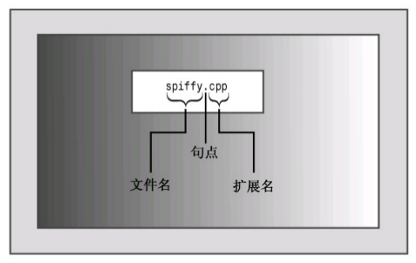

## 编译流程

假设编写了一个 C++ 程序，如何让它运行起来呢？具体的步骤取决于计算机环境和使用的 C++ 编译器，但大体的步骤如下。

1. 使用文本编辑器编写程序，并将其保存到文件中，这个文件就是程序的源代码。

2. 编译源代码。这意味着运行一个程序，将源代码翻译为主机使用的内部语言 —— 机器语言。包含了翻译后的程序的文件就是程序的目标代码 (object code)。

3. 将目标代码与其他代码链接起来。例如，C++ 程序经常使用的库。C++ 库包含一系列计算机例程 (被称为函数) 的目标代码，这些函数可以执行诸如在屏幕上显示信息或计算平方根等任务。链接指的是将目标代码与使用的函数库的目标代码 (库代码) 以及一些标准的启动代码 (startupcode) 组合起来，生成程序的运行阶段版本。包含该最终产品的文件被称为可执行代码。

4. C++ 程序编译的流程如下：

<mermaid>
{{`
flowchart LR
A[源代码] --> B[编译器]
B --> C[目标代码]
C --> D[链接程序]
D --> E[可执行程序]
`}}
</mermaid>

## 创建源代码文件

给源文件命名时，必须使用正确的后缀，将文件标识为 C++ 文件。这不仅告诉您该文件是 C++ 源代码，还将这种信息告知编译器 (如果 UNIX 编译器显示信息 "bad magic number"，则表明后缀不正确)。后缀由一个句点和一个或多个字符组成，这些字符被称作扩展名（如下图）。



使用什么扩展名取决于 C++ 实现，下表列出了一些常用的扩展名。例如，`spiffy.C` 是有效的 UNIX C++ 源代码文件名。注意，UNIX 区分大小写，这意味着应使用大写的 `C` 字符。实际上，小写 `c` 扩展名也有效，但标准 C 才使用小写的 `c`。因此，为避免在 UNIX 系统上发生混淆，对于 C 程序应使用 `c`， 而对于 C++ 程序则请使用 `C`。如果不在乎多输入一两个字符，则对于某些 UNIX 系统，也可以使用扩展名 `cc` 和 `cxx`。DOS 比 UNIX 稍微简单一点，不区分大小写，因此 DOS 实现使用额外的字母来区别 C 和 C++ 程序。

|       C++ 实现        |  源代码文件的扩展名   |
| :-------------------: | :-------------------: |
|         UNIX          |     C、cc、cxx、c     |
|        GNU C++        | C、cc、cxx、cpp、c++  |
|     Digital Mars      |       cpp、cxx        |
|      Borland C++      |          cpp          |
|        Watcom         |          cpp          |
| Microsoft Visual C++  |     cpp、cxx、cc      |
| Freestyle CodeWarrior | cp、cpp、cc、cxx、c++ |

## 编译和链接

最初，Stroustrup 实现 C++ 时，使用了一个 C++ 到 C 的编译器程序，而不是开发直接的 C++ 到目标代码的编译器。前者叫做 cfront (表示 C 前端，C front end)， 它将 C++ 源代码翻译成 C 源代码，然后使用一个标准 C 编译器对其进行编译。这种方法简化了向 C 的领域引入 C++ 的过程。其他实现也采用这种方法将 C++ 引入到其他平台。随着 C++ 的日渐普及，越来越多的实现转向创建 C++ 编译器，即直接将 C++ 源代码生成目标代码。这种直接方法加速了编译过程，并强调 C++ 是一种独立 (虽然有些相似) 的语言。

### UNIX 平台

最初，UNIX 命令 CC 调用 cfront， 但 cfront 未能紧跟 C++ 的发展步伐，其最后一个版本发布于 1993 年。当今的 UNIX 计算机可能没有编译器、有专用编译器或第三方编译器，这些编译器可能是商业的，也可能是自由软件，如 GNU g++ 编译器。如果 UNIX 计算机上有 C++ 编译器，很多情况下命令 CC 仍然管用，只是启动的编译器随系统而异。出于简化的目的，读者应假设命令 CC 可用，但必须认识到这一点，即对于下述讨论中的 CC，可能必须使用其他命令来代替。

请用 CC 命令来编译程序。名称采用大写字母，这样可以将它与标准 UNIX C 编译器 cc 区分开来。CC 编译器是命令行编译器，这意味着需要在 UNIX 命令行上输入编译命令。例如，要编译 C++ 源代码文件 `spiffy.C`，则应在 UNIX 提示符下输入如下命令:

``` sh
CC spiffy.C
```

程序没有错误的情况下，编译器将生成一个扩展名为 `o` 的目标代码文件。在这个例子中，编译器将生成文件 `spiffy.o`。

接下来，编译器自动将目标代码文件传递给系统链接程序，该程序将代码与库代码结合起来，生成一个可执行文件。在默认情况下，可执行文件为 `a.out`。如果只编译一个源文件，链接程序还将删除 `spiffy.o` 文件，因为这个文件不再需要了。要运行该程序，只要输入可执行文件的文件名即可：

``` sh
a.out
```

注意，如果编译新程序，新的可执行文件 `a.out` 将覆盖已有的 `a.out` (这是因为可执行文件占据了大量空间，因此覆盖旧的可执行文件有助于降低存储需求)。然而，如果想保留可执行文件，只需使用 UNIX 的 `mv` 命令来修改可执行文件的文件名即可。

与在 C 语言中一样，在 C++ 中，程序也可以包含多个文件。在这种情况下，可以通过在命令行上列出全部文件来编译程序：

``` sh
CC my.C precious.C
```

这将重新编译 `my.C` 文件，并将它与前面编译的 `precious.o` 文件链接起来。可能需要显式地指定一些库。例如，要访问数学库中定义的函数，必须在命令行中加上 `-lm` 标记：

``` sh
CC usingmath.C -lm
```

### Linux 平台

Linux 系统中最常用的编译器是 g++， 这是来自 Free SoftwareFoundation 的 GNU C++ 编译器。Linux 的多数版本都包括该编译器，但并不一定总会安装它。g++ 编译器的工作方式很像标准 UNIX 编译器。例如，下面的命令将生成可执行文件 `a.out`：

``` sh
g++ spiffy.cxx
```

有些 g++ 版本可能要求链接 C++ 库：

``` sh
g++ spiffy.cxx -lg++
```

若要编译多个源文件，只需将它们全部放到命令行中即可：

``` sh
g++ my.cxx precious.cxx
```

这将生成一个名为 `a.out` 的可执行文件和两个目标代码文件 `my.o` 和 `precious.o`。如果接下来修改了其中的某个源代码文件，如 `my.cxx`，则可以使用 `my.cxx` 和 `precious.o` 来重新编译：

``` sh
g++ my.cxx precious.o
```

GNU 编译器可以在很多平台上使用，包括基于 Windows 的 PC 和在各种平台上运行的 UNIX 系统。

### Windows 平台

#### Windows 命令行编译器

要在 Windows PC 上编译 C++ 程序，最便宜的方法是下载一个在 Windows 命令提示符模式 (在这种模式下，将打开一个类似于 MS-DOS 的窗口) 下运行的免费命令行编译器。Cygwin 和 MinGW 都包含编译器 GNU C++，且可免费下载，它们使用的编译器名为 g++。

要使用 g++ 编译器，首先需要打开一个命令提示符窗口。启动程序 Cygwin 和 MinGW 时，它们将自动为您打开一个命令提示符窗口。要编译名为 `great.cpp` 的源代码文件，请在提示符下输入如下命令：

``` sh
g++ great.cpp
```

如果程序编译成功，则得到的可执行文件名为 `a.exe`。

#### Windows 编译器

Windows 产品很多且修订频繁，无法对它们分别进行介绍。当前，最流行是 Microsoft Visual C++ 2010，可通过免费的 Microsoft Visual C++ 2010 学习版获得。虽然设计和目标不同，但大多数基于 Windows 的 C++ 编译器都有一些相同的功能。

通常，必须为程序创建一个项目，并将组成程序的一个或多个文件添加到该项目中。每个厂商提供的 IDE (集成开发环境) 都包含用于创建项目的菜单选项 (可能还有自动帮助)。必须确定的非常重要的一点是，需要创建的是什么类型的程序。通常，编译器提供了很多选择，如 Windows 应用程序、MFC Windows 应用程序、动态链接库、ActiveX 控件、DOS 或字符模式的可执行文件、静态库或控制台应用程序等。其中一些可能既有 32 位版本，又有 64 位版本。

程序一般是通用的，因此应当避免要求平台特定代码的选项，如 Windows 应用程序。相反，应让程序以字符模式运行。具体选项取决于编译器。一般而言，应选择包含字样 "控制台"、"字符模式" 或 "DOS 可执行文件" 等选项。例如，在 Microsoft Visual C++ 2010 中，应选择 Win32 Console Application (控制台应用程序) 选项，单击 Application Settings (应用程序设置)，并选择 Empty Project (空项目)。在 C++ Builder 中，应从 C++ Builder Projects (C++ Builder 项目) 中选择 Console Application (控制台应用程序)。

创建好项目后，需要对程序进行编译和链接。IDE 通常提供了多个菜单项，如 Compile (编译)、Build (建立)、Make (生成)、BuildAll (全部建立)、Link (链接)、Execute (执行)、Run (运行) 和 Debug (调试)，不过同一个 IDE 中，不一定包含所有这些选项。

- Compile 通常意味着对当前打开的文件中的代码进行编译。
- Build 和 Make 通常意味着编译项目中所有源代码文件的代码。这通常是一个递增过程，也就是说，如果项目包含 3 个文件，而只有其中一个文件被修改，则只重新编译该文件。
- Build All 通常意味着重新编译所有的源代码文件。
- Link 意味着 (如前所述) 将编译后的源代码与所需的库代码组合起来。
- Run 或 Execute 意味着运行程序。通常，如果您还没有执行前面的步骤，Run 将在运行程序之前自动完成这些步骤。
- Debug 意味着以步进方式执行程序。
- 编译器可能让您选择要生成调试版还是发布版。调试版包含额外的代码，这会增大程序、降低执行速度，但可提供详细的调试信息。

如果程序违反了语言规则，编译器将生成错误消息，并指出存在问题的行。遗憾的是，如果不熟悉语言，将难以理解这些消息的含义。有时，真正的问题可能在标识行之前；有时，一个错误可能引发一连串的错误消息。

::: tip 提示
改正程序错误时，应首先改正第一个错误。如果在标识为有错误的那一行上找不到错误，请查看前一行。
:::

需要注意的是，程序能够通过某个编译器的编译并不意味着它是合法的 C++ 程序；同样，程序不能通过某个编译器的编译也并不意味着它是非法的 C++ 程序。与几年前相比，现在的编译器更严格地遵循了 C++ 标准。另外，编译器通常提供了可用于控制严格程度的选项。

::: tip 提示
有时，编译器在不完全地构建程序后将出现混乱，它显示无法改正的、无意义的错误消息。在这种情况下，可以选择 Build All，重新编译整个程序，以清除这些错误消息。遗憾的是，这种情况和那些更常见的情况 (即错误消息只是看上去无意义，实际上有意义) 很难区分。
:::

通常，IDE 允许在辅助窗口中运行程序。程序执行完毕后，有些 IDE 将关闭该窗口，而有些 IDE 不关闭。如果编译器关闭窗口，将难以看到程序输出，除非您眼疾手快、过目不忘。为查看输出，必须在程序的最后加上一些代码：

``` cpp
{
    cin.get();      // add this statement
    cin.get();      // and maybe this, too
    return 0;
}
```

`cin.get()` 语句用于读取下一次键击，因此上述语句让程序等待，直到按下了 Enter 键 (在按下 Enter 键之前，键击将不被发送给程序，因此按其他键都不管用)。如果程序在其常规输入后留下一个没有被处理的键击，则第二条语句是必需的。例如，如果要输入一个数字，则需要输入该数字，然后按 Enter 键。程序将读取该数字，但 Enter 键不被处理，这样它将被第一个 `cin.get ()` 读取。
