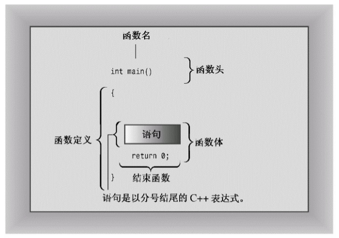

首先介绍一个显示消息的简单 C++ 程序，即使用 C++ 工具 `cout` 生成字符输出。源代码中包含一些供读者阅读的注释，这些注释都以 `//` 打头，编译器将忽略它们。C++ 对大小写敏感，也就是说区分大写字符和小写字符。这意味着大小写必须与示例中相同。例如，该程序使用的是 `cout`，如果将其替换为 Cout 或 COUT，程序将无法通过编译，并且编译器将指出使用了未知的标识符 (编译器也是对拼写敏感的，因此请不要使用 kout 或 coot)。文件扩展名 `cpp` 是一种表示 C++ 程序的常用方式，您可能需要使用第一章介绍的其他扩展名。

``` cpp
#include <iostream>                                                 // a PREPROCESSOR directive
int main()                                                                 // function header
{                                                                             // start of function body
    using namespace std;                                          // make definitions visible
    cout << "Come up and C++ me some time.";         // message
    cout << endl;                                                     // start a new line
    cout << "You won't regret it!" << endl;                 // more output
    return 0;                                                           // terminate main()
}                                                                          // end of function body
```

::: tip 程序调整
要在自己的系统上运行上述的代码示例，可能需要对其进行修改。有些窗口环境在独立的窗口中运行程序，并在程序运行完毕后自动关闭该窗口。正如第一章讨论的，要让窗口一直打开，直到您按任何键，可在 return 语句前添加一行语句 `cin.get()`。对于有些程序，要让窗口一直打开，直到您按任何键，必须添加两条这样的语句。如果您使用的系统很旧，它可能不支持 C++98 新增的特性。有些程序要求编译器对 C++11 标准提供一定的支持。对于这样的程序，将明确地指出这一点，并在可能的情况下提供非 C++11 代码。
:::

下面是运行编译后的程序时得到的输出结果:

```
Come up and C++ me some time.
You won't regret it!
```

::: tip C语言的输入和输出
如果已经使用过 C 语言进行编程，则看到 cout 函数 (而不是 printf() 函数) 时可能会小吃一惊。事实上，C++ 能够使用 printf()、scanf() 和其他所有标准 C 输入和输出函数，只需要包含常规 C 语言的 stdio.h 文件即可。不过本书介绍的是 C++，所以将使用 C++ 的输入工具，它们在 C 版本的基础上做了很多改进。
:::

使用函数来创建 C++ 程序时，通常先将程序组织为主要任务，然后设计独立的函数来处理这些任务。上述的代码示例非常简单，只包含一个名为 `main()` 的函数。代码示例包含下述元素:

- 注释，由前缀 `//` 标识
- 预处理器编译指令 `#include`
- 函数头 `int main()`
- 编译指令 `using namespace`
- 函数体，用 `{` 和 `}` 括起
- 使用 C++ 的 `cout` 工具显示消息的语句
- 结束 `main()` 函数的 `return` 语句

下面详细介绍这些元素。先来看看 `main()` 函数，因为了解 `main()` 的作用后，`main()` 前面的一些特性 (如预处理器编译指令) 将更易于理解。

## main() 函数

去掉修饰后，上述的示例程序的基本结构如下:

``` cpp
int main()
{
    statements
    return 0;
}
```

这几行表明有一个名为 `main()` 的函数，并描述了该函数的行为。这几行代码构成了函数定义 (function definition)。该定义由两部分组成：第一行 `int main()` 叫函数头 (function heading)，花括号 `{` 和 `}` 中包括的部分叫函数体。下图对 `main()` 函数做了说明。函数头对函数与程序其他部分之间的接口进行了总结；函数体是指出函数应做什么的计算机指令。在 C++ 中，每条完整的指令都称为语句。所有的语句都以分号结束，因此在输入示例代码时，请不要省略分号。`main()` 中最后一条语句叫做返回语句 (return statement)，它用于结束该函数。



::: tip 语句和分号
语句是要执行的操作。为理解源代码，编译器需要知道一条语句何时结束，另一条语句何时开始。有些语言使用语句分隔符。例如，FORTRAN 通过行尾将语句分隔开来，Pascal 使用分号分隔语句。在 Pascal 中，有些情况下可以省略分号，例如 END 前的语句后面，这种情况下，实际上并没有将两条语句分开。不过 C++ 与 C 一样，也使用终止符 (terminator)，而不是分隔符。终止符是一个分号，它是语句的结束标记，是语句的组成部分，而不是语句之间的标记。结论是：在 C++ 中，不能省略分号。
:::

就目前而言，需要记住的主要一点是，C++ 句法要求 `main()` 函数的定义以函数头 `int main()` 开始。通常，C++ 函数可被其他函数激活或调用，函数头描述了函数与调用它的函数之间的接口。位于函数名前面的部分叫做函数返回类型，它描述的是从函数返回给调用它的函数的信息。函数名后括号中的部分叫做形参列表 (argument list) 或参数列表 (parameter list)； 它描述的是从调用函数传递给被调用的函数的信息。这种通用格式用于 `main()` 时让人感到有些迷惑，因为通常并不从程序的其他部分调用 `main()`。然而，通常，`main()` 被启动代码调用，而启动代码是由编译器添加到程序中的，是程序和操作系统 (UNIX、Windows 7 或其他操作系统) 之间的桥梁。事实上，该函数头描述的是 `main()` 和操作系统之间的接口。

来看一下 `main()` 的接口描述，该接口从 `int` 开始。C++ 函数可以给调用函数返回一个值，这个值叫做返回值 (return value)。在这里，从关键字 `int` 可知，`main()` 返回一个整数值。接下来，是空括号。通常，C++ 函数在调用另一个函数时，可以将信息传递给该函数。括号中的函数头部分描述的就是这种信息。在这里，空括号意味着 `main()` 函数不接受任何信息，或者 `main()` 不接受任何参数。`main()` 不接受任何参数并不意味着 `main()` 是不讲道理的、发号施令的函数。相反，术语参数 (argument) 只是计算机人员用来表示从一个函数传递给另一个函数的信息。

简而言之，下面的函数头表明 `main()` 函数可以给调用它的函数返回一个整数值，且不从调用它的函数那里获得任何信息:

``` cpp
int main()
```

很多现有的程序都使用经典 C 函数头。在 C 语言中，省略返回类型相当于函数的返回类型为 `int`，但 C++ 逐步淘汰了这种用法。

``` cpp
main()      // original C style
```

也可以使用下面的变体。在括号中使用关键字 `void` 明确地指出，函数不接受任何参数。在 C++ (不是 C) 中，让括号空着与在括号中使用 `void` 等效 (在 C 中，让括号空着意味着对是否接受参数保持沉默)。

``` cpp
int main(void)      // very explicit style
```

有些程序员使用下面的函数头，并省略返回语句。这在逻辑上是一致的，因为 `void` 返回类型意味着函数不返回任何值。该变体适用于很多系统，但由于它不是当前标准强制的一个选项，因此在有些系统上不能工作。因此，读者应避免使用这种格式，而应使用 C++ 标准格式，这不需要做太多的工作就能完成。

``` cpp
void main()
```

最后，ANSI/ISO C++ 标准对那些抱怨必须在 `main()` 函数最后包含一条返回语句过于繁琐的人做出了让步。如果编译器到达 `main()` 函数末尾时没有遇到返回语句，则认为 `main()` 函数以如下语句结尾。这条隐含的返回语句只适用于 `main()` 函数，而不适用于其他函数。

``` cpp
return 0;
```

::: tip 提示
请读者认真思考，为什么 main() 函数不能使用其他名称呢？
:::

之所以将上述示例程序中的函数命名为 `main()`，原因是必须这样做。通常，C++ 程序必须包含一个名为 `main()` 的函数 (不是 Main()、MAIN () 或 mane ()。记住，大小写和拼写都要正确)。由于示例程序只有一个函数，因此该函数必须担负起 `main()` 的责任。在运行 C++ 程序时，通常从 `main()` 函数开始执行。因此，如果没有 `main()`，程序将不完整，编译器将指出未定义 `main()` 函数。

但存在一些例外情况。例如，在 Windows 编程中，可以编写一个动态链接库 (DLL) 模块，这是其他 Windows 程序可以使用的代码。由于 DLL 模块不是独立的程序，因此不需要 `main()`。用于专用环境的程序 — 例如机器人中的控制器芯片，可能不需要 `main()`。有些编程环境提供一个框架程序，该程序调用一些非标准函数，如 `_tmain()`。在这种情况下，有一个隐藏的 `main ()`，它会调用 `_tmain()`。但常规的独立程序都需要 `main()`，本书讨论的都是这种程序。

## C++ 注释

C++ 注释以双斜杠 `//` 打头。注释是程序员为读者提供的说明，通常标识程序的一部分或解释代码的某个方面。编译器忽略注释，毕竟，它对 C++ 的了解至少和程序员一样，在任何情况下，它都不能理解注释。对编译器而言，下述示例代码的执行结果是一样的，不管有没有注释。

:::: code-group
::: code-group-item 有注释
``` cpp
#include <iostream>                                                 // a PREPROCESSOR directive
int main()                                                                 // function header
{                                                                             // start of function body
    using namespace std;                                          // make definitions visible
    cout << "Come up and C++ me some time.";         // message
    cout << endl;                                                     // start a new line
    cout << "You won't regret it!" << endl;                 // more output
    return 0;                                                           // terminate main()
}
```
:::
::: code-group-item 无注释
``` cpp
#include <iostream>
int main()
{
    using namespace std;
    cout << "Come up and C++ me some time.";
    cout << endl;
    cout << "You won't regret it!" << endl;
    return 0;
}
```
:::
::::

C++ 注释以 `//` 打头，到行尾结束。注释可以位于单独的一行上，也可以和代码位于同一行。

::: tip 提示
应使用注释来说明程序。程序越复杂，注释的价值越大。注释不仅有助于他人理解这些代码，也有助于程序员自己理解代码，特别是隔了一段时间没有接触该程序的情况下。
:::

C++ 也能够识别 C 注释，C 注释包括在符号 `/` 和 `/` 之间，例如 `#include <iostream> /* a C-Style comment */`。由于 C 风格注释以 `*/` 结束，而不是到行尾结束，因此可以跨越多行。可以在程序中使用 C 或 C++ 风格的注释，也可以同时使用这两种注释。但应尽量使用 C++ 注释，因为这不涉及到结尾符号与起始符号的正确配对，所以它产生问题的可能性很小。事实上，C99 标准也在 C 语言中添加了 `//` 注释。

## C++ 预处理器

下面简要介绍一下需要知道的一些知识。如果程序要使用 C++ 输入或输出工具，请提供这样两行代码:

``` cpp
#include <iostream>
using namespace std;
```

可使用其他代码替换第 2 行，这里使用这行代码旨在简化该程序 (如果编译器不接受这几行代码，则说明它没有遵守标准 C++98 标准)。为使程序正常工作，只需要知道这些。下面更深入地介绍一下这些内容。

C++ 和 C 一样，也使用一个预处理器，该程序在进行主编译之前对源文件进行处理 (第一章介绍过，有些 C++ 实现使用翻译器程序将 C++ 程序转换为 C 程序。虽然翻译器也是一种预处理器，但这里不讨论这种预处理器，而只讨论这样的预处理器，即它处理名称以 `#` 开头的编译指令)。不必执行任何特殊的操作来调用该预处理器，它会在编译程序时自动运行。

``` cpp
#include <iostream>                                                 // a PREPROCESSOR directive
```

上述的编译指令导致预处理器将 iostream 文件的内容添加到程序中。这是一种典型的预处理器操作：在源代码被编译之前，替换或添加文本。

为什么要将 iostream 文件的内容添加到程序中呢？答案涉及程序与外部世界之间的通信。iostream 中的 io 指的是输入 (进入程序的信息) 和输出 (从程序中发送出去的信息)。C++ 的输入与输出方案涉及 iostream 文件中的多个定义。为了使用 `cout` 来显示消息，第一个程序需要这些定义。`#include` 编译指令会将 iostream 文件的内容随源代码文件的内容一起被发送给编译器。实际上，iostream 文件的内容将取代程序中的代码行 `#include <iostream>`。原始文件没有被修改，而是将源代码文件和 iostream 文件组合成一个复合文件，编译的下一阶段将使用该文件。

::: warning 注意
使用 cin 和 cout 进行输入和输出的程序必须包含 iostream 文件。
:::

## 头文件名

像 iostream 这样的文件叫做包含文件 (include file) — 由于它们被包含在其他文件中；也叫头文件 (header file) — 由于它们被包含在文件起始处。C++ 编译器自带了很多头文件，每个头文件都支持一组特定的工具。C 语言的传统是，头文件使用扩展名 `h`， 将其作为一种通过名称标识文件类型的简单方式。例如，头文件 `math.h` 支持各种 C 语言数学函数，但 C++ 的用法变了。现在，对老式 C 的头文件保留了扩展名 `h` (C++ 程序仍可以使用这种文件)， 而 C++ 头文件则没有扩展名。有些 C 头文件被转换为 C++ 头文件，这些文件被重新命名，去掉了扩展名 `h` (使之成为 C++ 风格的名称)， 并在文件名称前面加上前缀 `c` (表明来自 C 语言)。例如，C++ 版本的 `math.h` 为 `cmath`。有时候 C 头文件的 C 版本和 C++ 版本相同，而有时候新版本做了一些修改。对于纯粹的 C++ 头文件 (如 iostream) 来说，去掉 `h` 不只是形式上的变化，没有 `h` 的头文件也可以包含名称空间。下表对头文件的命名约定进行了总结。

|  头文件类型  |             约定              |    示例    |                            说明                             |
| :----------: | :---------------------------: | :--------: | :---------------------------------------------------------: |
| C++ 旧式风格 |         以 `.h` 结尾          | iostream.h |                      C++ 程序可以使用                       |
|  C 旧式风格  |         以 `.h` 结尾          |   math.h   |                     C、C++ 程序可以使用                     |
| C++ 新式风格 |          没有扩展名           |  iostream  |         C++ 程序可以使用，支持使用 `namespace std`          |
|  转换后的 C  | 加上前缀 `c`， 没有文件扩展名 |   cmath    | C++ 程序可以使用，可以使用不是 C 的特性，如 `namespace std` |

由于 C 使用不同的文件扩展名来表示不同文件类型，因此用一些特殊的扩展名 (如 `.hpp` 或 `.hxx`) 表示 C++ 头文件是有道理的，ANSI/ISO 委员会也这样认为。问题在于究竟使用哪种扩展名，因此最终他们一致同意不使用任何扩展名。
