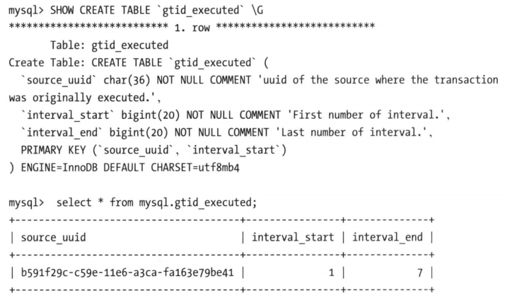
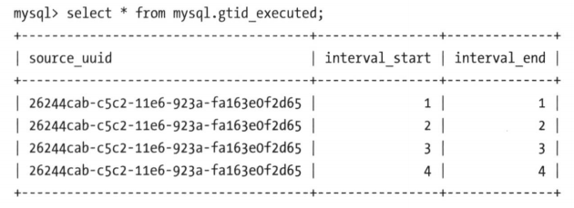
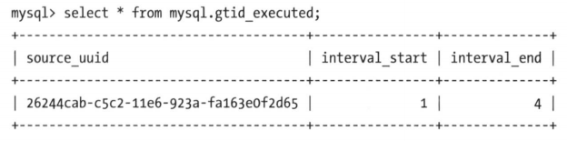

GTID 是全局事务标识符，是 MySQL 5.6 版本开始在主从复制方面推出的重量级特性。有了 GTID，一个事务在集群中就不再孤独，在每一个节点中，都存在具有相同标识符的兄弟们和它做伴；同一个事务，在同一个节点中出现多次的情况，也不会再重现了。GTID 的出现，直接的效果就是，每一个事务在集群中具有了唯一性的意义，这在运维方面意义非凡，给 DBA 带来了很大的便利性，因为再也不需要为不断地找点而烦恼了。从直观上可以想到 GTID 的便利性，如下：

- 根据 GTID 可以快速地知道事务最初是在哪个实例上提交的。
- 基于 GTID 搭建主从复制更加简单，确保每个事务只会被执行一次。
- 基于 GTID 复制，可以更方便地实现 Replication 的 Failover。因为不用像传统模式复制那样去找 `master_log_file` 和 `master_log_pos`。
- MySQL Group Replication 的节点间复制完全依赖 GTID。并且，在 Group Replication 集群节点进行 Recovery 重新加入到集群中的操作中，会选择一个节点作为 Donor， 然后基于 Purged 的 GTID 开始同步数据。
- 同样是在 MySQL Group Replication 中，集群使用 GTID 来标记事务，或者叫冲突验证，用于跟踪每个实例上提交的事务，确定哪些事务可能有冲突。
- GTID 的引入，让每一个事务在集群事务的海洋中有了秩序，使得 DBA 在运维中做集群变迁时更加方便，能够做到心中有数。

## GTID 概念

### 什么是 GTID

每提交一个事务，当前执行的线程都会拿到一个唯一标识符，此标识符不仅对其源 MySQL 实例是唯一的，而且在给定的复制环境中的所有 MySQL 实例中也是唯一的。所有事务与其 GTID 之间都是一一对应的，GTID 的格式如下：

```
GTID = source_id:sequence_id
```

GTID 由两部分组成，分别是 `source_id` 和 `sequence_id`。`source_id` 是源服务器的唯一标识，通常使用服务器的 `server_uuid` 来表示 `source_id`。`sequence_id` 是在事务提交时由系统顺序分配的一个序列号，相同 `source_id` 值的事务对应的 `sequence_id` 在 Binlog 文件中是递增且连续有序的。可以通过 `SHOWMASTER STATUS` 或 `SHOW SLAVE STATUS` 查看当前实例执行过的 GTID 信息，它以集合的方式呈现。

```
mysql> show master status \G
*************************** 1. row***************************
             File: mysql-bin.000002
         Position: 561
     Binlog_Do_DB:
 Binlog_Ignore_DB:
Executed Gtid Set: b591f29c-csge-11e6-a3ca-fa163e79be41:1-2
```

其中，上述实例的 `source_id` 为 `b591f29c-csge-11e6-a3ca-fa163e79be41`， 总共提交了 2 个事务。

### GTID 集合

GTID 集合是一组全局事务标识符，格式如下：

```
gtid_set:
    uuid_set [, uuid_set] ...
    | ''

uuid_set:
    uuid:interval[:interval] ...

uuid:
    hhhhhhhh-hhhh-hhhh-hhhh-hhhhhhhhhhhh

h:
    [0-9|A-F]

interval:
    n[-n]
    (n >= 1)
```

GTID 集合在 MySQL 服务器中有常见的几种使用方式，例如：`gtid_executed` 和 `gtid_purged` 变量存储的值为 GTID 集合。其中，UUID 按照字母排序，数字之间以升序排列。

GTID 始终保存在主从实例中，可以通过检查二进制日志来确定事务的来源。此外，一旦在给定的 MySQL 实例中提交了事务，具有相同 GTID 的事务便会被该服务器忽略。而且，在主实例上提交的事务在从库上只可以应用一次，这有助于保持主从同步的一致性。

### GTID 生命周期

GTID 的生命周期如下：

- 1、MASTER 产生 GTID
    - 在 MASTER 上执行一个事务，MASTER 将会产生一个 GTID 信息，并保存到 Binlog 中。

- 2、发送 Binlog 信息到从库上
    - 将二进制日志信息发送到 SLAVE 所在的服务器上，并且存储在 Relay Log（中继日志）中，SLAVE 读取 GTID 并设置其 `gtid_next` 的值为该 GTID 值，从而告知 SLAVE 必须使用此 GTID 记录下一个事务。

- 3、SLAVE 执行 GTID
    - SLAVE 首先验证其是否已经在自己的二进制日志中使用过了该 GTID 号。如果未使用过，SLAVE 则写入该 GTID，应用其事务，并将事务写入二进制日志。SLAVE 首先读取和检查事务的 GTID，在提交事务之前，SLAVE 不仅要保证 SLAVE 没有应用具有该 GTID 的事务，而且还要保证没有其他会话已经读取了该 GTID 但尚未提交，即不允许多个客户端应用相同的事务。

- 4、SLAVE 不生成 GTID
    - 由于 `gtid_next` 不为空，SLAVE 不会尝试为该事务生成新的 GTID，而是从 `gtid_next` 中读取 GTID 值并写入二进制日志中，来标识一个事务的 GTID 值，之后在集群中都会始终对应这个 GTID 值，且不会发生变化，起到了 `身份证` 标签的作用。

## GTID 维护

### gtid_executed 表

在 MySQL 5.7.5 版本及以上的版本中，`mysql` 库中新增了表 `gtid_executed`，表结构如下所示。该表中的每一行表示一个 GTID 或 GTID 集合，包括 `source_uuid`、集合开始和结束的事务 ID。



只有当 `gtid_mode` 为 `ON` 或 `ON_PERMISSIVE` 时，GTID 才会保存在 `mysql.gtid_executed` 表中。GTID 存储在该表中，不会考虑是否启用了二进制日志。

- 当未启用 Binlog 时，每个事务都会记录到 `gtid_executed` 表中。
- 当启用 Binlog 时，每个事务不仅会记录到 `gtid_executed` 表中，而且当 Binlog Rotate 或服务器正常关闭时，服务器会将 GITD 信息写入新的二进制日志。如果服务器异常关闭，GTID 不会被存入 `mysql.gtid_executed` 表中，那么在这种情况下，MySQL 在恢复时，会将这些 GTID 信息添加到表中，并写入 `gtid_executed` 系统变量中。

::: warning 注意
`RESET MASTER` 操作会清空 `gtid_executed` 表。
:::

### gtid_executed 表压缩

随着数据库的不断更新，`mysql.gtid_executed` 表会存入很多 GTID 信息，并且这些事务 ID 会构成一个序列，如下：



可以通过事务的间隔来代替原来的每个 GTID 信息，来缩减磁盘空间的消耗。



当 MySQL 启用 GTID 时，服务器会定期对 `mysql.gtid_executed` 表执行此类型的压缩，可以通过设置 `executed_gtids_compression_period` 变量来控制在压缩表之前允许的事务数，从而控制压缩率。该变量的默认值是 1000，表示表的压缩在每 1000 个事务之后执行，设置为 0 表示不执行压缩。

::: warning 注意
当 Binlog 开启，且 `executed_gtids_compression_period` 值未使用时，MySQL Binlog 轮换会引起 `mysql.gtid_executed` 表的自动压缩。
:::

MySQL 中有一个单独的后台线程来执行 `gtid_executed` 表压缩的操作，线程信息如下：


该线程睡眠直到执行了 `executed_gtids_compression_period` 事务后，唤醒该线程执行 `gtid_execute` 表的压缩，然后继续睡眠，如此循环。当禁用二进制日志功能，并将此变量设置为 0 时，该线程永远不会被唤醒。

## GTID 限制

由于基于 GTID 的复制依赖于事务，所以在使用 GTID 时，有些 MySQL 特性不支持，如下：

- 事务中混合多个存储引擎，会产生多个 GTID
    - 当使用 GTID 时，如果在同一个事务中，更新包括了非事务引擎（如 MyISAM） 和事务引擎（如 InnoDB）表的操作，就会导致多个 GTID 分配给同一个事务。

- 主从库的表存储引擎不一致，会导致数据不一致
    - 如果主从库的存储引擎不一致，例如一个是事务存储引擎，一个是非事务存储引擎，则会导致事务和 GTID 之间一对一的关系被破坏，结果导致基于 GTID 的复制不能正确地运行。

- 基于 GTID 模式复制，不支持 `CREATE TABLE ... SELECT` 语句
    - 因为使用基于行模式的复制时，该语句实际上被记录为两个单独的事件，一个是创建表，另一个是将原表中的数据插入到刚刚创建的新表中。当在事务中执行该语句时，在一些情况下，这两个事务可能接收到相同的事务 ID，这意味着包含插入操作的事务将被从库跳过。因此，在使用基于 GTID 的复制时，不支持 `CREATE TABLE ... SELECT`。

- 不支持 `CREATE_TEMPORARY TABLE` 和 `DROP TEMPORARY TABLE`
    - 使用 GTID 复制时，不支持 `CREATE TEMPORARY TABLE` 和 `DROP TEMPORARY TABLE`。但是在 `autocommit=1` 的情况下可以创建临时表，MASTER 创建临时表不会产生 GTID 信息，所以不会同步到 SLAVE 上，但是删除临时表时，会产生 GTID 信息，最终导致主从同步中断。

- 不推荐在 GTID 模式的实例上进行 `mysql_upgrade`
    - 因为 `mysql_upgrade` 的执行过程要创建或修改系统表（非事务引擎），所以不建议在开启 GTID 模式的实例上使用带有 `--write-binlog` 选项的 `mysql_upgrade`。
