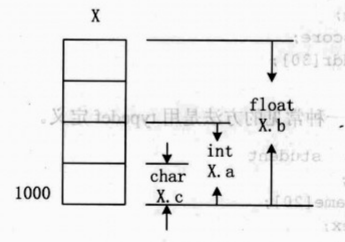
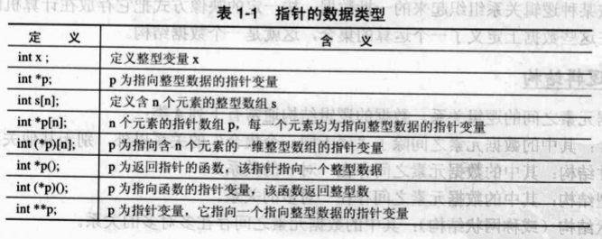

## 结构体

结构体是一种构造数据类型，把不同类型的数据组合成一个整体。例如定义一个学生数据类型：

``` cpp
struct student
{
    int num;
    char name[20];
    char sex;
    int age;
    float score;
    char addr[30];
};
```

`struct` 是定义结构体的关键字，`student` 是结构体的名称，结构体变量的声明有 4 种方式：

- 第一种，用已定义的结构体类型名定义变量

``` cpp
struct student s1, s2;
```

- 第二种，在定义结构体类型的同时定义结构体变量

``` cpp
struct student
{
    int num;
    char name[20];
    char sex;
    int age;
    float score;
    char addr[30];
} s1, s2;
```

- 第三种，不定义结构体类型名，直接定义结构体变量

``` cpp
struct
{
    int num;
    char name[20];
    char sex;
    int age;
    float score;
    char addr[30];
} s1, s2;
```

- 第四种，使用 `typedef` 关键字定义结构体

``` cpp
typedef struct student
{
    int num;
    char name[20];
    char sex;
    int age;
    float score;
    char addr[30];
} Stu;
```

上述的 `Stu` 是一种数据类型，代表上面自定义的结构体类型，而不是结构体变量，它可以用于定义结构体变量。

``` cpp
Stu s1, s2;
```

::: tip 提示
`Stu s1, s2;` 与 `struct student s1, s2;` 是完全等效的。
:::

## 联合体

联合体是使几个不同类型的变量共占一段内存（相互覆盖）。共用体类型的定义与结构体类型的定义类似，但所用关键字不同，联合体类型使用关键字 `umion` 定义。

``` cpp
union exam
{
    char c;
    int a;
    float b;
} x;
```

联合体内的三个变量在地址空间上以低地址对齐，联合体所占内存空间大小取决于最大的成员所占用的内存空间，如下图所示。



``` cpp
#include <stdio.h>

int main()
{
    union int_char
    {
        int i;
        char ch[2];
    } x;

    x.i = 24897;
    printf("i=%o\n", x.i);
    printf("ch0=%d, ch1=%d\nch0=%c, ch1=%c", x.ch[0], x.ch[1], x.ch[0], x.ch[1]);
    return 0;
}
```

```
i=60501
ch0=65, ch1=97
ch0=A, ch1=a
```

## 枚举

如果某个变量的值只为有限的几种可能，那最好将此变量定义为枚举变量。`enum` 是定义枚举类型的关键字。
   
``` cpp
enum ColorType {red, yellow, blue, white, black} color;
```
    
枚举值标识符是常量不是变量，系统自动给予它们 `0，1，2，3 ...` 值，因此枚举类型是基本数据类型。

枚举值只能是一些标识符（字母开头，字母、数字和下画线组合），不能是基本类型常量。虽然它们有值 `0，1，2，3 ...`，但如果这样定义类型 `enum ColorType {0， 1， 2， 3， 4}` 是错误的。

可在定义枚举类型时，对枚举常量重新定义值，如

``` cpp
enum color_name {red=3, yellow, blue, white=8, black};
```
    
此时 `yellow` 为 4，`blue` 为 5，`black` 为 9，即系统自动往后延续。

枚举类型的数据就是用户定义的一组标识符（枚举常量）的序列，其存储的是整型数值，因此枚举类型是基本数据类型。由于枚举常量对应整数值，因此枚举类型数据与整数之间可以比较大小，枚举变量还可以进行 `++`、`-` 等运算。枚举类型不能直接输入输出，只能通过赋值取得枚举的常量值，输出也只能间接进行。

## 指针

指针是 C/C++ 语言中变化最多，使用难度最大的内容，掌握得好会提高程序的运行效率，用得不好常常会造成很多意想不到的错误。在此总结一下与指针相关的数据类型，如下表所示：


