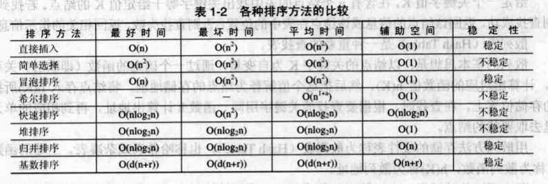

## 概述

数据结构（Data Structure）是指数据对象及该数据对象集合中的数据元素之间的相互关系（即数据元素的组织形式）。数据结构的内容可归纳为 3 个部分：逻辑结构、存储结构和运算集合。按某种逻辑关系组织起来的一批数据，按一定的映像方式把它存放在计算机的存储器中，并在这些数据上定义了一个运算的集合，这就是一个数据结构。

数据的逻辑结构，即数据元素之间的逻辑关系，通常可以分为以下 4 类：

- `集合`：其中的数据元素之间除了 "属于同一个集合" 的关系以外，别无其他关系。
- `线性结构`：其中的数据元素之间存在一对一的关系。
- `对型结构`：其中的数据元素之间存在一对多的关系。
- `图状结构（或称网状结构）`：其中的数据元素之间存在多对多的关系。

数据的存储结构，即数据元素及它们之间的相互关系在计算机存储器内的表示（又称映像），也称为数据的物理结构。数据的存储结构可以采用以下 4 中基本的存储方式得到：

- 顺序存储方式
- 链接存储方式
- 索引存储方式
- 散列存储方式

## 线性表

线性表是具有相同数据类型的 `n(n>=0)` 个数据元素的有限序列。

### 顺序表

采用顺序存储结构的线性表称之为顺序表。顺序表 L 的第 i 个元素的存储位置和第 1 个元素的存储位置的关系为：

``` cpp
LOC(ai) = LOC(a1) + (i - 1) * m
```

其中 `LOC(a1)` 是线性表的第 1 个数据元素的存储位置，通常称为线性表的起始位置或基地址。顺序表的存储结构定义如下：

``` cpp
#define maxsize 1024    /* 线性表的最大长度 */
typedef int datatype;   /* 定义表元素的类型 */

typedef struct
{
    datatype elem[maxsize];     /* 存储表节点的数组 */
    int length;                 /* 表的长度 */
} SequeList;
```

在顺序表第 i 个元素前插入结点，则需要把 i 到 n 的所有元素向后移动一位，最后把新元素插入到第 i 个位置。需要注意的是，在进行移动的时候，必须是从 n 到 i 依次向后移动，如果从 i 到 n 依次向后移动，则最后 i+1 到 n+1 位置的所有元素都是一样的值，即原来第 i 元素的值。

删除第 i 个元素时，需要将 i+1 到 n 元素依次向前移动。移动顺序与插入顺序刚好相反，是从前向后进行，即从 i 到 n 依次向前移动一个位置。

### 链表

以链式结构存储的线性表称之为链表。链表包括：单链表、双向链表、循环链表。单链表的存储结构如下：

``` cpp
typedef struct LNode {
    int data;
    struct LNode *next;
} LinkList;
```

在单链表第 i 个元素前插入结点，或者删除第 i 个结点，都只需要修改第 i-1 个结点的 next 指针。所以进行插入和删除的主要工作就是找到第 i-1 个结点，这需要从头结点开始查找。

当需要在第 1 个元素前插入元素，或者删除第 1 个元素时，对于不带头结点的单链表，则需要修改头指针。这就是带头结点和不带头结点的单链表在进行操作时的主要区别。不带头结点的单链表在进行插入和删除操作时，在程序的开始总是要判断是不是在表头进行操作。带头结点的单链表则不需要此操作。

::: tip 线性表顺序存储与链式存储的比较
1、从时间的角度考虑，在按位置查找数据（读），或在查找元素的前趋和后继等方面，顺序存储有着较大的优势。在插入数据、删除数据时（写），链式存储就有较大的优势，这是由于在链表中只要修改指针即可做到；而在顺序表中进行插入和删除时，平均要移动表中将近一半的数据元素。

2、从空间的角度考虑，顺序表的存储空间是静态分配的，在程序执行之前必须规定其存储规模。而链表的存储空间是动态分配的，只要内存空间有空闲，就不会产生内存溢出。
:::

## 栈和队列

### 栈

栈是只能在表的一端进行插入和删除操作的线性表。允许插入和删除操作的一端称为顶，不允许插入和删除操作的一端称为底。访问结点时依照后进先出（LIFO）或先进后出（FILO）的原则。栈有两种存储方式，分别是 `顺序栈` 和 `链栈`。

### 队列

队列是只能在表的一端进行插入操作，在表的另一端进行删除操作的线性表。允许插入的一端称为队尾，允许删除的一端称为队头。队列遵循先进先出（FIFO）的原则。队列有两种存储方式，分别是 `顺序队列（循环队列）` 和 `链队列`。

队列在顺序存储下会发生溢出。在队空时进行出队的操作称为 "下溢"，而在队满时进行入队的操作称为 "上溢"。解决假溢出的方法是将顺序队列假想为一个首尾相接的圆环，称之为 `循环队列`。循环队列并不真的是一个循环的存储空间，它本身是一个顺序空间，只不过把它假想成一个首尾相连的空间。当指针走到最后一个元素后，再往后移动就强制指向第 1 个元素。由于不知道何时到了最后一个元素，一般只要是指针向后移动，都强制进行求余运算。

## 树

树 (Tree) 是 `n(n≥0)` 个结点的有限集 T。当 `n=0` 时，称为空树；当 `n>0` 时，满足以下条件：

- 1. 有且仅有一个结点被称为树根（Root）结点。
- 2. 当 `n>1` 时，除根结点以外的其余 `n-1` 个结点可以划分成 `m(m>0)` 个互不相交的有限 T1，T2，...，Tm，其中每一个集合本身又是一棵树，称为根的子树 (SubTree)。

::: tip 树的术语说明
- `结点的度（degree）`：结点拥有的子树的数目。
- `树的度`：树中最大的结点的度数即为树的度。
- `结点的层次（level）`：从根结点算起，根为第 1 层，它的子结点为第 2 层。若某结点在第 i 层，则其子结点就在第 i+1 层。
- `树的高度（depth）`：树中结点的最大层次数。
:::

## 查找

给定一个关键字值 K，在含有 n 个结点的表中找出关键字等于给定值 K 的结点。若找到，则查找成功，返回该结点的信息或该结点在表中的位置；否则查找失败，返回相关的指示信息。

散列表 (HashTable) 是一种重要的查找表。散列的基本思想是以结点的关键字 K 为自变量，通过一个确定的函数（即映射）关系 h，计算出对应的函数值 `h(k)`，然后把这个值解释为结点的存储地址，将结点存入 `h(k)` 所指向的存储位置上。在查找时，根据要查找的关键字用同一函数 h 计算出存储地址，再到相应的单元里去取要找的结点。

用散列方法存储的线性表称为散列表 (HashTable)，也称哈希表或杂表。上述的函数 h 称为散列函数，`h(k)` 称为散列地址。

两个不同的关键字，由子散列函数值相同，因而被映射到同一表位置上，该现象称为冲突。发生冲突的两个关键字，称为该散列函数的同义词 (Synonym)。通常情况下，由于关键字的个数大于散列表的长度，因此无论怎样设计 h，也不可能完全避免冲突。我们只能做到，在设计 h 时尽可能使冲突最少，同时还需要确定解决冲突的方法，使发生冲突的同义词都能够存储到散列表中。

::: tip 散列表与其他查找表的区别
1. 线性表查找、二分查找、分块查找、二叉排序树、B- 树等查找方法的共同特点是：记录在存储结构中的相对位置是随机的，所以在查找时都要通过一系列的关键字比较确定待查记录在存储结构中的位置；也就是说，这类查找是以关键字的比较为基础的。
          
2. 散列表则不同，它是通过散列函数将记录的关键字为自变量映射成记录的存储地址，散列表的生成就是把记录逐一存放到以相应函数值为地址的存储单元中。在散列表中查找时，只需用散列函数计算得到待查记录的存储地址，即可得到所查信息，必要时可以通过冲突处理方法处理冲突。冲突越小，效率越高。
:::

## 排序

排序是根据记录关键字的递增或递减关系，将一组记录的次序重新排列。

### 排序的稳定性

在待排序的文件中，若存在多个关键字相同的记录，经过排序后这些具有相同关键字的记录之间的相对次序保持不变，则称该排序算法是稳定的；否则，若具有相同关键字的记录之间的相对次序发生变化，则称该排序算法是不稳定的。

::: tip 排序算法的分类
- 按是否涉及数据的内、外存交换分类：外排序、内排序。
- 按策略划分内部排序算法：插入排序、选择排序、交换排序、归并排序、基数排序等。
:::

### 排序算法性能评价

下表为各种排序算法的比较。判断一个算法性能的好坏，主要有两个标准：

- 执行算法所需的时间
- 执行算法所需的辅助空间



选取排序算法时需要考虑的因素有：

- 待排序的记录数目
- 记录本身信息量的大小
- 关键字的结构及其分布情况
- 对排序稳定性的要求
- 语言工具的条件、辅助空间的大小
