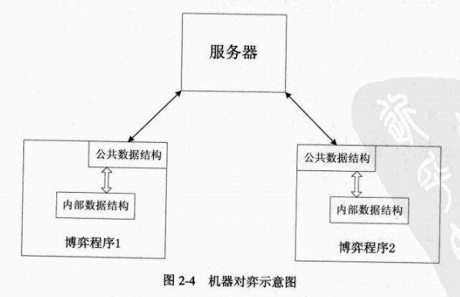

一般棋手不可能理解计算机内的数据结构，同样计算机也很难看懂普通的象棋棋盘，所以要实现人与计算机程序的较量，必须要有一个中介，在人与计算机博弈程序之间传递信息。这个中介就是一个图形界面程序，它将局面及计算机走棋以图形界面展示给手，棋手的走棋以特定数据结构传递给计算机博弈程序。

象棋博弈程序可以自带一个图形界面，它接收用户（棋手）的输入，即棋手所走的棋，然后将自己思考后所走的棋以图形显示在屏幕上，展示给棋手。用于人机博弈的象棋博弈程序由五大部分构成。

- 局面表示
- 走法生成
- 搜索算法
- 局面评估
- 图形界面

如何让两个象棋博弈程序自动进行象棋比赛呢？不同的博弈程序采用了不同的数据结构来表示棋盘、局面、及走法，如何让一个博弈程序理解另一个博弈程序的走法呢？即使它理解，那又如何与第 3 个、第 4 个博弈程序比赛呢，难道要让它理解所有可能的程序走法？这显然是不现实的，不过这也不是什么太大的问题，只要所有的博弈程序能够理一种公共的棋盘、局面、走法表示，那它们之间就可以通信，如下图所示。

服务器在这里起着比赛裁判的作用，包括计时、判断一方是否违规、判和等。服务器程序必须要能理解公共的数据结构，它可以是图形界面和非图形界面形式。一个博弈程序将走法转换成公共数据结构发送给服务器，服务器首先判断走法是否符合中国象棋规则，然后将走法发送给另一个博弈程序。

服务器程序与普通博弈程序的区别：服务器程序除了包括局面表示和走法生成外，还要计时、判和，但可以不包含评估函数和搜索算法。博弈程序在进行机器对弈时，并不需要自己在屏幕上捕捉对手的输入，所以不需要图形界面。常常把这种博弈程序叫做博弈程序引擎。博弈程序引擎由五部分组成：

- 局面表示
- 走法生成
- 搜索算法
- 局面评估
- 通信处理
