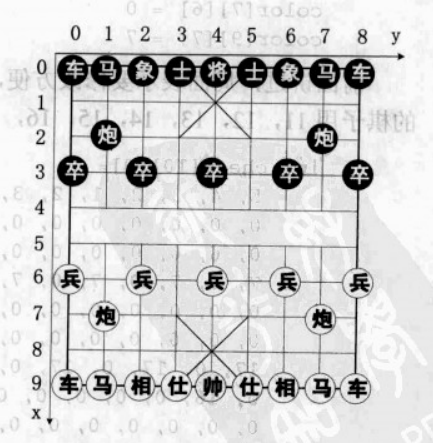
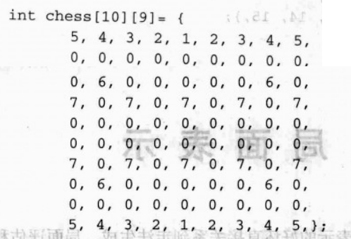
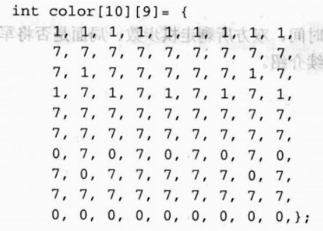
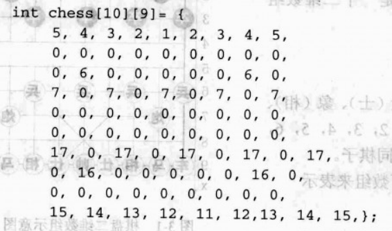

局面表示是象棋程序的基础，局面表示的好坏直接关系到走法生成、搜索算法和局面评估的效率，从而影响象棋程序得到的最佳走法。局面有狭义和广义之分，用于适应不同的需求。在本章所要表示的局面，主要是指狭义的局面，包含 3 个部分：

- 棋盘
- 当前该走棋的一方
- 红黑双方所剩棋子及其在棋盘上的分布

::: tip 广义局面所包含的内容
双方所剩时间、双方所剩走棋步数、局面是否将军、未吃子步数、历史走法等。
:::

中国象棋棋盘是一个 10 行 9 列的共 90 个交叉点的网状结构，要表示这样一个结构，最简单的方法就是矩阵，在程序语言里面就是一个二维数组 `chess[10][9]`，如图下图所示。值得一提的是，再简单的表示方法也必须包含局面的三要素：棋盘、棋子、走棋方。




棋子种类为 7 种：将（帅）、仕（士）、象（相）、马、车、炮、卒（兵），可以用 1，2，3，4，5，6，37 共七个整数来分别表示这 7 种不同棋子。一个开局的局面就可以用如下数组来表示：



0 表示没有棋子，很明显红方棋子在数组的下半部，黑方棋子在数组的上半部。一旦比赛开始，双方棋子就会越过河界，这时就根本无法分清双方棋子：如 7 究竞代表红兵还是黑卒。这时候我们可以用一个辅助数组来表示棋子的颜色，即棋子究竞是红方棋子还是黑方棋子。红方为 0，黑方为 1，没有棋子的地方为 7。



如 `chess[3][0]=7` 表示该位置有一个红兵，然后 `color[3][0]=1`，表示是黑卒。当红方走棋马二进三时，要对 chess 数组和 color 数组分别修改：

```
chess[7][6]=4
chess[9][7]=0
chess[7][6]=0
chess[9][7]=7
```

前面讲过，局面表示要修改方便，用两个数组来表示，是比较复杂的。如果我们把黑的棋子用 11，12，13，14，15，16，17 来表示，则一个 chess 数组就可以了。



1，2，3，4，5，6，7 分别表示黑方将，士，象，马，车，炮，卒。11，12，13，14，15，16，17 分别表示红方帅，仕，相，马，车，炮，兵。这样双方棋子都用唯一的整数表示，不会产生歧意了。
