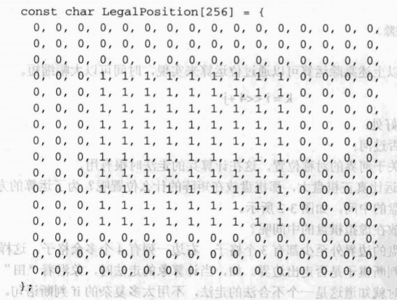
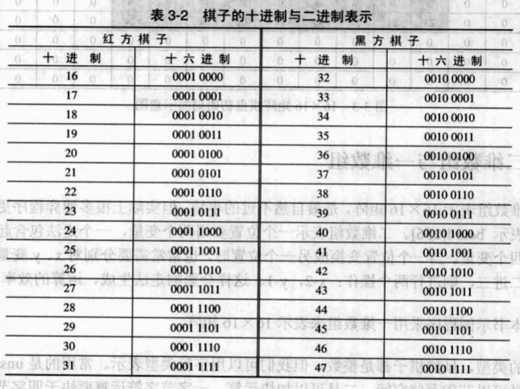
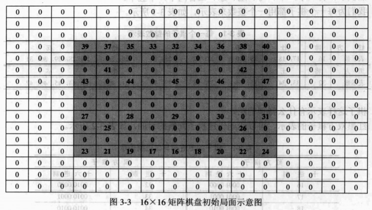

局面表示是象棋程序的基础，局面表示的好坏直接关系到走法生成、搜索算法和局面评估的效率，从而影响象棋程序得到的最佳走法。局面有狭义和广义之分，用于适应不同的需求。在本章所要表示的局面，主要是指狭义的局面，包含 3 个部分：

- 棋盘
- 红黑双方所剩棋子及其在棋盘上的分布
- 当前该走棋一方

::: tip 广义局面所包含的内容
双方所剩时间、双方所剩走棋步数、局面是否将军、未吃子步数、历史走法等。
:::

## 简单的表示方法

中国象棋棋盘是一个 10 行 9 列的共 90 个交叉点的网状结构，要表示这样一个结构，最简单的方法就是矩阵，在程序语言里面就是一个二维数组 `chess[10][9]`，如图下图所示。值得一提的是，再简单的表示方法也必须包含局面的三要素：棋盘、棋子、走棋方。


棋子种类为 7 种：将（帅）、仕（士）、象（相）、马、车、炮、卒（兵），可以用 1，2，3，4，5，6，37 共七个整数来分别表示这 7 种不同棋子。一个开局的局面就可以用如下数组来表示：


0 表示没有棋子，很明显红方棋子在数组的下半部，黑方棋子在数组的上半部。一旦比赛开始，双方棋子就会越过河界，这时就根本无法分清双方棋子：如 7 究竞代表红兵还是黑卒。这时候我们可以用一个辅助数组来表示棋子的颜色，即棋子究竞是红方棋子还是黑方棋子。


红方为0，黑方为1，没有棋子的地方为7。

如 `chess[3][0]=7` 表示该位置有一个红兵，然后 `color[3][0]=1`，表示是黑卒。当红方走棋马二进三时，要对 chess 数组和 color 数组分别修改：

```
chess[7][6]=4
chess[9][7]=0
chess[7][6]=0
chess[9][7]=7
```

前面讲过，局面表示要修改方便，用两个数组来表示，是比较复杂的。如果我们把黑的棋子用 11，12，13，14，15，16，17 来表示，则一个 chess 数组就可以了。


1，2，3，4，5，6，7 分别表示黑方将，士，象，马，车，炮，卒。11，12，13，14，15，16，17 分别表示红方帅，仕，相，马，车，炮，兵。这样双方棋子都用唯一的整数表示，不会产生歧意了。

## 扩展数组表示方法

虽然 10 × 9 的矩阵可以完全表示棋盘和棋子，但为了运算方便，我们可以将矩阵扩展成 16 × 16 的形式。这是在算法设计中，常常采用的技巧："空间换取时间"。多出了 166 个整数空间对现在的计算机简直就不值一提。

### 棋盘表示

::: tip 为什么采用16×16矩阵呢？
当然是为了加快运算速度。
:::

`16=2^4`，可以使二维坐标与一维坐标方便的转换。如：二维下标 `[i][j]`，对应一维下标 `[k]`。

``` cpp
k = i * 16 + j
i = k / 16 (整除)     
j = k % 16 (取余)
```

由于 `16 = 2^4`，所以上述乘除运算可以通过位运算来实现，执行时间可以大幅缩短。

``` cpp
k = i << 4 + j
```

`16 × 16` 矩阵还有其他好处，可以快速判断兵是否过河，方便生成棋子位置关于河界的对称位置，这在计算兵的走法时很有用。

::: tip 16×16的棋盘矩阵远比真正棋盘大，那棋盘放在矩阵的什么位置呢？
为了运算的方便，将真正棋盘放在虚拟棋盘的中间，如下图所示。
:::


为什么有效棋盘要放在虚拟棋盘的中间呢？因为这样可以保证有效棋盘的边界外至少都有 3 个格子，右边一列有 4 个多余格子。这样做的目的是加快走法生成，还可以判断棋子是否走出边界。如，当计算象的走法时，象沿着 "田" 字行走，当走到虚拟边框上时就知道这是一个不合法的走法，不用太多复杂的 if 判断语。如 `chess[10][9]`，判断一个位置 `[i][j]` 是否合法，常用如下判断：

``` cpp
if (i >= 0 && i <= 9 && j >= 0 && j <= 8) {

}
```

要想快速判断棋子位置的合法性，，还要用一个辅助数组 `LegalPosition[256]`。



要判断位置 k 是否合法，只需要看 `LegalPosition[k]` 的值就行了。`LegalPosition[k]=1`，则在棋盘上，`LegalPosition[k]=0`，则在棋盘外了，非法位置。

### 棋子表示

棋子的表示也要做一些调整，红黑双方各为 16 个棋子：

- 红棋子：帅一个，车、马、炮、相、仕各两个，兵五个。
- 黑棋子：将一个，车、马、炮、象、士各两个，卒五个。

每一个棋子都用一个整数来表示，如下图所示：


棋子这样表示有什么特别的呢？红黑双方棋子的表示，可以达到快速判断棋子的目的，如下图所示：



通过上述的表格，可以看出红黑棋子的特点：

```
红方棋子 & 16 = 1       按位与运算
黑方棋子 & 32 = 1       按位与运算
```

假设当前走棋方为 side，其值随便为 0 或 1，如需要判断位置上的棋子是本方棋子，则可以使用以下方法：

```
Sidetag = side * 16 + 16;
棋子数值 & Sidetag == 1，则为本方棋子
```

由于 0 用来表示无棋子，所以不能用 0 ~ 15 来表示红方或者黑方的棋子。当然，也可用 64 ~ 79 表示某方棋子。16 × 16 矩阵的棋盘初始局面，如下图所示：



### 二维数组与一维数组

用二维数组表示 16 × 16 矩阵，这是最自然不过的事情。但实际上很多博弈程序更喜欢用一维数组来表示 `board [256]`。二维数组表示一个棋子位置要用两个变量，一个走法包含起点和终点则就需要四个变量。当一个位置变换成另一个位置时，也常常需要分别对 x、y 变量做加减运算；如马二进三，则进行两个操作：x-2，y-1。这样会影响走法生成、算法运算的效率。

数组的类型，虽然棋子都是整数，但我们可以用字符类型来表示。常用的是 `unsigned char` 类型。一是可以节省存储空间，二是可以加快运算，一个字节字符的运算要快于四个字节的整数运算。

## 字符串表示局面

使用数组表示局面，在程序处理起来是比较方便的，但也有空间的浪费。因为棋子在开局时最多有 32 个，用 10 × 9 矩阵也有 58 个位置是空的，16 × 16 矩阵则有 224 个位置浪费。虽然计算机内存对这点空间耗费也算不了什么，但是如果数据在网络上传输，受带宽及网络数据流量影响，应该尽量压缩传输的数据量。在机器对弈时，常常采用字符串作为公共数据结构在网络上传输。

::: tip 在国际象棋中，一般采用FEN格式字符串来表示局面
FEN 就是 "福斯夫 - 爱德华兹记号法"（Forsyth-Edwards Notation），这是一种使用 ASCII 码字符描述国际象棋局面的标准。FEN 是建立在 19 世纪由报社记者 S ・D ・福斯夫设计的记录局面的标准基础上的。后来为了适合象棋软件的需要，由爱德华兹对此做了少许修改。一份标准的局面记号，对需要大量交换共享局面数据的国际象棋程序设计等工作具有尤其重要的作用。
:::

在国内，由黄晨引入 FEN 格式串表示中国象棋局面，目前有很多中国象棋博弈引擎采用 FEN 格式串。FEN 是专门用来表示象棋局面的记录规范，在这个规范下，一个局面可以简单地用一行 "FEN 格式串" 来表示，而不必繁琐地说："红帅在四路底线，黑将在五路底线 ......"。由于它是文本格式的（只牵涉到很有限的几个字母、数字和符号），因此在网络上传输棋局就非常方便，不用把棋图画在纸上或用文字笨拙地描述了，而是用棋谱编辑软件摆好局面，自动得到 FEN 格式串，再贴到诸如 Web 网页、BBS、电子论坛等能够传递文字的网络应用平台上。读者面对 FEN 格式串时，只要借助于棋谱编辑软件，使用 "复制" 和 "粘贴" 就可以完全重现局面，使得棋谱交流变得快速而高效。
