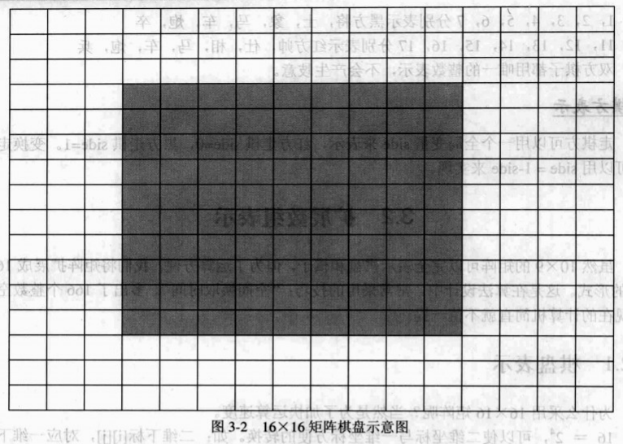
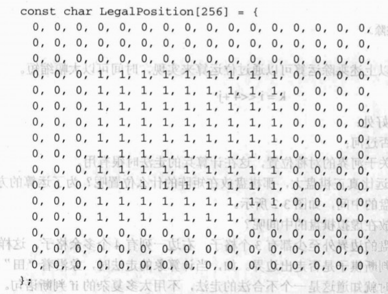
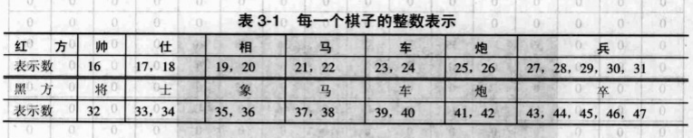
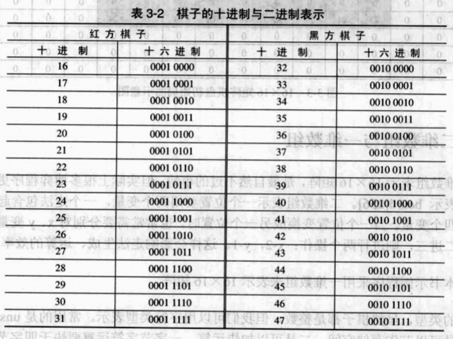
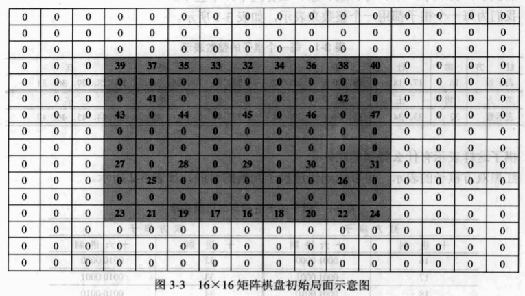

虽然 10 × 9 的矩阵可以完全表示棋盘和棋子，但为了运算方便，我们可以将矩阵扩展成 16 × 16 的形式。这是在算法设计中，常常采用的技巧："空间换取时间"。多出了 166 个整数空间对现在的计算机简直就不值一提了。

## 棋盘表示

::: tip 为什么采用16×16矩阵呢？
当然是为了加快程序的运算速度。
:::

`16=2^4`，可以使二维坐标与一维坐标方便地互相转换。如：二维下标 `[i][j]`，对应一维下标 `[k]`。

``` cpp
k = i * 16 + j
i = k / 16 (整除)     
j = k % 16 (取余)
```

由于 `16 = 2^4`，所以上述乘除运算可以通过位运算来实现，执行时间可以大幅缩短。

``` cpp
k = i << 4 + j
```

`16 × 16` 矩阵还有其他好处，可以快速判断兵是否过河，方便生成棋子位置关于河界的对称位置，这在计算兵的走法时很有用。

::: tip 16×16的棋盘矩阵远比有效棋盘大，那有效棋盘应该放在矩阵中的什么位置呢？
为了运算的方便，将有效棋盘放在虚拟棋盘的中间，如下图所示。
:::



为什么有效棋盘要放在虚拟棋盘的中间呢？因为这样可以保证有效棋盘的边界外至少都有 3 个格子，右边一列有 4 个多余格子。这样做的目的是加快走法生成，还可以判断棋子是否走出边界。如，当计算象的走法时，象沿着 "田" 字行走，当走到虚拟边框上时就知道这是一个不合法的走法，不用太多复杂的 if 判断语。如 `chess[10][9]`，判断一个位置 `[i][j]` 是否合法，常用如下判断：

``` cpp
if (i >= 0 && i <= 9 && j >= 0 && j <= 8) {

}
```

要想快速判断棋子位置的合法性，还要用一个辅助数组 `LegalPosition[256]`。



要判断位置 k 是否合法，只需要看 `LegalPosition[k]` 的值就行了。`LegalPosition[k]=1`，则在棋盘上，`LegalPosition[k]=0`，则在棋盘外了，即非法位置。

## 棋子表示

棋子的表示也要做一些调整，红黑双方各为 16 个棋子：

- 红棋子：帅一个，车、马、炮、相、仕各两个，兵五个。
- 黑棋子：将一个，车、马、炮、象、士各两个，卒五个。

每一个棋子都用一个整数来表示，如下图所示：



棋子这样表示有什么特别的呢？红黑双方棋子的表示，可以达到快速判断棋子的目的，如下图所示：



通过上述的表格，可以看出红黑棋子的特点：

```
红方棋子 & 16 = 1       按位与运算
黑方棋子 & 32 = 1       按位与运算
```

假设当前走棋方为 side，其值随便为 0 或 1，如需要判断位置上的棋子是本方棋子，则可以使用以下方法：

```
Sidetag = side * 16 + 16;
棋子数值 & Sidetag == 1，则为本方棋子
```

由于 0 用来表示无棋子，所以不能用 0 ~ 15 来表示红方或者黑方的棋子。当然，也可用 64 ~ 79 表示某方棋子。16 × 16 矩阵的棋盘初始局面，如下图所示：



## 二维数组与一维数组

用二维数组表示 16 × 16 矩阵，这是最自然不过的事情。但实际上很多博弈程序更喜欢用一维数组来表示 `board [256]`。二维数组表示一个棋子位置要用两个变量，一个走法包含起点和终点则就需要四个变量。当一个位置变换成另一个位置时，也常常需要分别对 x、y 变量做加减运算；如马二进三，则进行两个操作：x-2，y-1。这样会影响走法生成、算法运算的效率。

数组的类型，虽然棋子都是整数，但我们可以用字符类型来表示。常用的是 `unsigned char` 类型。一是可以节省存储空间，二是可以加快运算，一个字节字符的运算要快于四个字节的整数运算。
