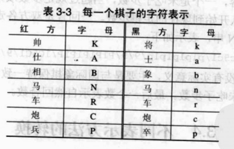

使用数组表示局面，在程序处理起来是比较方便的，但也有空间的浪费。因为棋子在开局时最多有 32 个，用 10 × 9 矩阵也有 58 个位置是空的，16 × 16 矩阵则有 224 个位置浪费。虽然计算机内存对这点空间耗费也算不了什么，但是如果数据在网络上传输，受带宽及网络数据流量影响，应该尽量压缩传输的数据量。在机器对弈时，常常采用字符串作为公共数据结构在网络上传输。

::: tip 在国际象棋中，一般采用FEN格式字符串来表示局面
FEN 就是 "福斯夫 - 爱德华兹记号法"（Forsyth-Edwards Notation），这是一种使用 ASCII 码字符描述国际象棋局面的标准。FEN 是建立在 19 世纪由报社记者 S ・D ・福斯夫设计的记录局面的标准基础上的。后来为了适合象棋软件的需要，由爱德华兹对此做了少许修改。一份标准的局面记号，对需要大量交换共享局面数据的国际象棋程序设计等工作具有尤其重要的作用。
:::

在国内，最早由黄晨引入 FEN 格式串表示中国象棋局面，目前有很多中国象棋博弈引擎采用 FEN 格式串。FEN 是专门用来表示象棋局面的记录规范，在这个规范下，一个局面可以简单地用一行 "FEN 格式串" 来表示，而不必繁琐地说："红帅在四路底线，黑将在五路底线 ......"。由于它是文本格式的（只牵涉到很有限的几个字母、数字和符号），因此在网络上传输棋局就非常方便，不用把棋图画在纸上或用文字笨拙地描述了，而是用棋谱编辑软件摆好局面，自动得到 FEN 格式串，再贴到诸如 Web 网页、BBS、电子论坛等能够传递文字的网络应用平台上。读者面对 FEN 格式串时，只要借助于棋谱编辑软件，使用 "复制" 和 "粘贴" 就可以完全重现局面，使得棋谱交流变得快速而高效。

FEN 串如何表示国际象棋读者可以自行参考资料，这里主要将 FEN 串如何表示中国象棋。

## 棋子表示

在 FEN 串中，每一个棋子用一个字符表示，如下图所示：



为什么马不用 H（horse），象不用 E（Elephant）表示呢？这主要是为了与国象棋相对应，FEN 最开始就是为表示国际象棋而设计的。

## 棋盘表示

局面表示的方法如下：

- 将棋盘分成十行来看待，从上往下为第 0，1，...，9 行，每一行用一个字符串表示。
- 棋盘共 9 列，所以每行最多有 9 个字符。如果交叉点上有棋子，则用棋子对应字符表示，如果没有棋子，则用数字表示出相邻连续的空位数。
- 一行末尾是空位，而相邻下一行开始也是空位，则相邻两行的空位要分开计数，不得连续计数。
- 局面的 FEN 字符串由每行字符串相连而成，相邻行字符串由 "/" 分隔开。
- 所有字符、数字、"/" 之间均不得有空格。


如中国象棋开局的 FEN 串为：

```
rnbakabnr/9/1c5c1/p1p1p1p1p/9/9/P1P1P1P1P/1C5C1/9/RNBAKABNR
```

第 0 行全是棋子，所以由 9 个字符构成；第 1 行一个棋子也没有，所以用数字 9 表示；第 2 行两个炮，中间是 5 个空位，表示成字符串为 `1c5c1`；第 3 行为 5 个兵和 4 个空位，则为 `p1p1p1p1p`。值得一提的是，约定棋盘上方是黑棋，下方是红棋；为了区分红棋和黑棋，在 FEN 串中使用小写字母表示黑棋，大写字母表示红棋。

## 走方表示

轮到哪一方走棋，也用字符表示，红方用 `w`，黑方用 `b`。FEN 格式串中走方表示方法：

- 在棋盘字符串的尾部加上一个空格和表示走方的字符。

修改上面中国象棋开局的 FEN 串，引入走方。因为中国象棋开局始终是红方先行，所以更改后的 FEN 串如下：

```
rnbakabnr/9/1c5c1/p1p1p1p1p/9/9/P1P1P1P1P/1C5C1/9/RNBAKABNR w
```

## 走棋步数

FEN 串还有两个内容，一个是未吃子步数，当超过规定步数双方均未吃子要判和。另一个是自然回合数，就是从开始到现在的走棋步数。一回合是双方各走一步棋。再次修改中国象棋开局的 FEN 串，表示如下：

```
rnbakabnr/9/1c5c1/p1p1p1p1p/9/9/P1P1P1P1P/1C5C1/9/RNBAKABNR w - - 0 1
```

走法后的两个 "-" 符号没有实际意义，主要是为了与国际象棋保持一致。倒数第 2 个数表示未吃子步数。最后一个数表示自然回合数。
