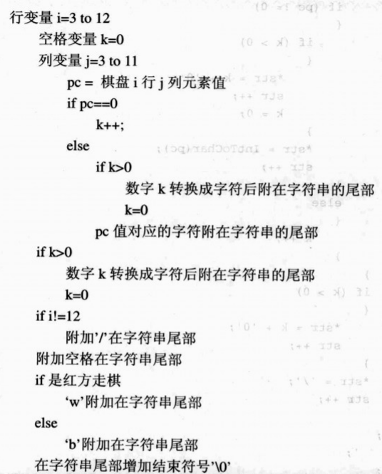
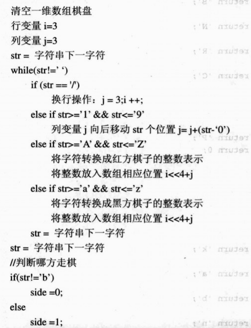
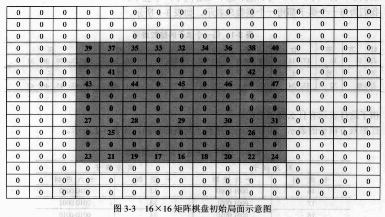

一维数组与 FEN 串表示方法是非常重要的两种表示方法，博弈程序内部用到一维数组，与其他博弈程序对弈进行通信时要用到 FEN 串。博弈程序必须要能够将局面正确地从一维数组转换成 FEN 串，也要能够将 FEN 串表示的局面转换成一维数组。

### 一维数组转换成 FEN 串



``` cpp
#include <stdio.h>

//---------------变量声明-----------------------------------------------

#define BOARD_SIZE 256		// 棋盘的大小，16 x 16
#define FEN_LENGTH 128		// FEN串的长度

int side;							// 轮到哪一方走棋，0表示红方，1表示黑方
int idles;							// 未吃子步数
int rounds;							// 自然回合数
char FenString[FEN_LENGTH];       // 局面的FEN串格式
unsigned char board[BOARD_SIZE];  // 棋盘数组

//---------------函数定义-----------------------------------------------

// 将棋子的整数值转换成字符表示
char IntToChar(int a)
{
    if (a < 32)
    {
        // 红方棋子
        switch (a)
        {
            case 16: return 'K';	// 帅
            case 17:
            case 18: return 'A';	// 仕
            case 19:
            case 20: return 'B';	// 相
            case 21:
            case 22: return 'N';	// 马
            case 23:
            case 24: return 'R';	// 车
            case 25:
            case 26: return 'C';	// 炮
            case 27:
            case 28:
            case 29:
            case 30:
            case 31: return 'P';	// 兵
            default: return 0;
        }
    }
    else
    {
        // 黑方棋子
        switch (a)
        {
            case 32: return 'k';	// 将
            case 33:
            case 34: return 'a';	// 士
            case 35:
            case 36: return 'b';	// 象
            case 37:
            case 38: return 'n';	// 马
            case 39:
            case 40: return 'r';	// 车
            case 41:
            case 42: return 'c';	// 炮
            case 43:
            case 44:
            case 45:
            case 46:
            case 47: return 'p';	// 卒
            default: return 0;
        }
    }
}

// 将一维数组表示的局面转换成FEN串
// 输出结果：rnbakabnr/9/1c5c1/p1p1p1p1p/9/9/P1P1P1P1P/1C5C1/9/RNBAKABNR w - - 0 1
void ArrayToString()
{

    char* str;
    int i, j, k, pc;

    str = FenString;

    // 一共 10 行
    for (i = 3; i <= 12; i++)
    {
        // 棋盘空位的数量
        k = 0;

        // 一共 9 列
        for (j = 3; j <= 11; j++)
        {
            // 通过位移将二维坐标转换成一维坐标，快速得到棋子的整数值
            pc = board[(i << 4) + j];
            if (pc == 0)
            {
                k++;
            }
            else
            {
                if (k > 0)
                {
                    // 处理棋盘空位，将数字转换成字符
                    *str = '0' + k;
                    str++;
                    k = 0;
                }
                // 将棋子的整数值转换成字符表示
                *str = IntToChar(pc);
                str++;
            }
        }

        if (k > 0)
        {
            // 处理棋盘空位，将数字转换成字符
            *str = '0' + k;
            str++;
        }

        // 相邻行字符串使用'/'分隔开
        *str = '/';
        str++;
    }

    str--;
    *str = ' ';

    // 处理轮到哪一方走棋
    str++;
    *str = (side == 0 ? 'w' : 'b');

    str++;
    *str = ' ';

    // 处理国象的兼容字符
    str++;
    *str = '-';

    str++;
    *str = ' ';

    // 处理国象的兼容字符
    str++;
    *str = '-';

    str++;
    *str = ' ';

    // 处理未吃子步数
    str++;
    *str = '0' + idles;

    str++;
    *str = ' ';

    // 处理自然回合数
    str++;
    *str = '0' + rounds;

    // 处理字符串结束符
    str++;
    *str = '\0';
}
```

### FEN 串转换成一维数组



``` cpp
#include <stdio.h>

//---------------变量声明-----------------------------------------------

#define BOARD_SIZE 256		// 棋盘的大小，16 x 16
#define FEN_LENGTH 128		// FEN串的长度

int side;							// 轮到哪一方走棋，0表示红方，1表示黑方
int idles;							// 未吃子步数
int rounds;							// 自然回合数
char FenString[FEN_LENGTH];       // 局面的FEN串格式
unsigned char board[BOARD_SIZE];  // 棋盘数组

//---------------函数定义-----------------------------------------------

// 清空棋盘数组
void ClearBoard()
{
    side = 0;
    for (int i = 0; i < BOARD_SIZE; i++)
    {
        board[i] = 0;
    }
}

// 输出棋盘数组
void OutputBoard()
{
    for (int i = 1; i <= BOARD_SIZE; i++)
    {
        printf("%3d", board[i - 1]);
        if (i % 16 == 0)
        {
            printf("\n");
        }
    }
}

// FEN串中棋子对应的数组下标
int CharToArrayIndex(char ch)
{
    switch (ch)
    {
        case 'k':
        case 'K':return 0;	// 将
        case 'a':
        case 'A':return 1;	// 士
        case 'b':
        case 'B':return 2;	// 象
        case 'n':
        case 'N':return 3;	// 马
        case 'r':
        case 'R':return 4;	// 车
        case 'c':
        case 'C':return 5;	// 炮
        case 'p':
        case 'P':return 6;	// 卒
        default:return 7;
    }
}

// 将FEN串表示的局面转换成一维数组
// 输入参数：rnbakabnr/9/1c5c1/p1p1p1p1p/9/9/P1P1P1P1P/1C5C1/9/RNBAKABNR w - - 0 1
void StringToArray(const char* FenStr)
{
    int i, j, k;
    const char* str;

    // 红方棋子的值
    int pcWhite[7] = { 16,17,19,21,23,25,27 };
    // 黑方棋子的值
    int pcBlack[7] = { 32,33,35,37,39,41,43 };

    // 清空棋盘数组
    ClearBoard();

    str = FenStr;
    if (*str == '\0')
    {
        return;
    }

    i = 3;	// 行下标
    j = 3;	// 列下标

    while (*str != ' ')
    {
        // 处理相邻行字符串
        if (*str == '/')
        {
            i++;
            j = 3;
            if (i > 12)
            {
                break;
            }
        }
            // 处理棋盘空位
        else if (*str >= '1' && *str <= '9')
        {
            for (k = 0; k < (*str - '0'); k++)
            {
                if (j >= 11)
                {
                    break;
                }
                j++;
            }
        }
            // 处理红方棋子
        else if (*str >= 'A' && *str <= 'Z')
        {
            if (j <= 11)
            {
                k = CharToArrayIndex(*str);
                if (k < 7)
                {
                    if (pcWhite[k] >= 16 && pcWhite[k] <= 31)
                    {
                        board[(i << 4) + j] = pcWhite[k];
                        // 递增棋子的整数值
                        pcWhite[k]++;
                    }
                }
                j++;
            }
        }
            // 处理黑方棋子
        else if (*str >= 'a' && *str <= 'z')
        {
            if (j <= 11)
            {
                k = CharToArrayIndex(*str);
                if (k < 7)
                {
                    if (pcBlack[k] >= 32 && pcBlack[k] <= 47)
                    {
                        board[(i << 4) + j] = pcBlack[k];
                        // 递增棋子的整数值
                        pcBlack[k]++;
                    }
                }
                j++;
            }
        }

        // 处理字符串结束符
        str++;
        if (*str == '\0')
        {
            return;
        }
    }

    // 处理轮到哪一方走棋
    str++;
    if (*str == 'b')
    {
        side = 1;
    }
    else
    {
        side = 0;
    }

    // 处理未吃子步数
    str += 6;
    idles = *str - '0';

    // 处理自然回合数
    str += 2;
    rounds = *str - '0';
}

int main()
{

    printf("*************************************************\n");
    printf("                FEN 串转换为一维数组               \n");
    printf("*************************************************\n");
    StringToArray("rnbakabnr/9/1c5c1/p1p1p1p1p/9/9/P1P1P1P1P/1C5C1/9/RNBAKABNR w - - 0 1");
    OutputBoard();
    printf("\nside: %d, idles: %d, rounds: %d\n", side, idles, rounds);
    return getchar();
}
```

程序运行的输出结果如下：

```
*************************************************
                FEN 串转换为一维数组               
*************************************************
  0  0  0  0  0  0  0  0  0  0  0  0  0  0  0  0
  0  0  0  0  0  0  0  0  0  0  0  0  0  0  0  0
  0  0  0  0  0  0  0  0  0  0  0  0  0  0  0  0
  0  0  0 39 37 35 33 32 34 36 38 40  0  0  0  0
  0  0  0  0  0  0  0  0  0  0  0  0  0  0  0  0
  0  0  0  0 41  0  0  0  0  0 42  0  0  0  0  0
  0  0  0 43  0 44  0 45  0 46  0 47  0  0  0  0
  0  0  0  0  0  0  0  0  0  0  0  0  0  0  0  0
  0  0  0  0  0  0  0  0  0  0  0  0  0  0  0  0
  0  0  0 27  0 28  0 29  0 30  0 31  0  0  0  0
  0  0  0  0 25  0  0  0  0  0 26  0  0  0  0  0
  0  0  0  0  0  0  0  0  0  0  0  0  0  0  0  0
  0  0  0 23 21 19 17 16 18 20 22 24  0  0  0  0
  0  0  0  0  0  0  0  0  0  0  0  0  0  0  0  0
  0  0  0  0  0  0  0  0  0  0  0  0  0  0  0  0
  0  0  0  0  0  0  0  0  0  0  0  0  0  0  0  0

side: 0, idles: 0, rounds: 1
```

对应的 16 × 16 矩阵棋盘初始局面如下：


